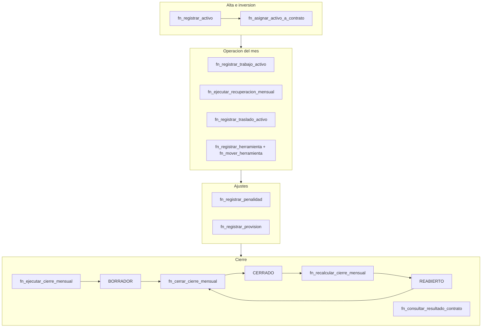

# CONTEXTO MAESTRO — Plataforma SESGA REYSER · Grupo 5

> **Para qué sirve este documento.** Es el contexto completo del trabajo del Grupo 5 (capacidades **activos-e-inversion** y **cierre-mensual**) dentro de la plataforma SESGA REYSER. Está escrito para que **una IA (o una persona nueva) pueda leerlo y saber exactamente qué hacer y cómo, sin margen de error**: qué es el proyecto, cómo está construido, qué reglas son innegociables, cómo se agrega un endpoint, cómo se corre y se prueba, qué existe hoy y qué falta. Todo lo afirmado aquí está verificado contra el repositorio real al 2026-06-23.
>
> Si vas a hacer un cambio: **lee primero las secciones 3 (Reglas) y 4 (Flujo de trabajo). No improvises fuera de ese flujo.**

---

## 1. El proyecto en 60 segundos

- **Qué es:** "Esqueleto base de una plataforma SaaS componible orientada a capacidades para la gestión operacional-financiera por contrato, período y unidad operativa." (cita textual del `README.md`).
- **Multiempresa (multi-tenant):** todo cuelga de una `empresa`; cada request lleva la empresa en una cabecera HTTP.
- **Dividido en capacidades** (módulos de dominio). Las 9 del sistema: `gobierno_central`, `contratos`, `costeo_directo`, `gastos_compartidos`, `produccion`, `facturacion`/`valorizacion`, `activos_e_inversion`, `cierre_mensual`, `reportes`.
- **El Grupo 5 es dueño de 2 capacidades:**
  - **`activos_e_inversion`** — activos fijos, herramientas, su asignación a contratos, traslados, trabajos, recuperación de inversión. **31 endpoints.**
  - **`cierre_mensual`** — estado de resultados por contrato/período, penalidades, provisiones. **10 endpoints.**
  - **Total Grupo 5: 41 endpoints.**
- **Repos:**
  - Código del producto: `CODEPLEX-SAC/plataforma-sesga-reyser` (local: `C:/Users/user/Desktop/CSRAYSER/plataforma-sesga-reyser`).
  - Páginas/descargables de documentación (Vercel): `roberto3101/gerson-compartido` (local: `C:/Users/user/Desktop/gerson-compartido`).

## 2. Stack y el principio central

| Capa | Tecnología |
|---|---|
| Frontend | React + Vite (+ Bun) |
| Backend | Go |
| Base de datos | CockroachDB **v26.2.1** |
| Acceso a datos | **Stored procedures** (funciones PL/pgSQL `fn_*`) |

**EL PRINCIPIO QUE LO EXPLICA TODO:** el procedimiento SQL **`fn_*` es la única fuente de verdad ("el contrato")**. El backend NO escribe consultas de negocio a mano; toda interacción con la base pasa por un `fn_*`. A partir de la firma de cada `fn_*`, unos **generadores** producen automáticamente el endpoint HTTP del backend (Go) y el cliente del frontend (TypeScript). **No se escribe un handler Go por operación ni se registran rutas a mano.**

```
SQL fn_*.sql  →  catalogo_capacidades.json  →  3 generadores PowerShell  →  backend .go  +  cliente .ts
   (contrato)        (registro de capacidades)                               (endpoints)   (cliente API)
```

## 3. Reglas innegociables (NO romper)

1. **Todo en español** (nombres, mensajes, código de dominio): "lenguaje ubicuo".
2. **Cero comentarios en el código.** El código se autoexplica. Nada de `--`, `//`, `/* */` ni anotaciones.
3. **Nada de consultas de negocio directas** en handlers/casos de uso del backend: siempre vía `fn_*`.
4. **El SQL es el contrato.** Para cambiar un endpoint, cambias el `fn_*.sql` y regeneras. No editas a mano los archivos generados (ver §5).
5. **Multi-tenant obligatorio:** toda tabla tiene `id_empresa`; todo `fn_*` valida que la empresa exista y esté vigente (`EMPRESA_NO_VIGENTE`).
6. **Convención de SP:** prefijo `fn_`, `RETURNS JSONB`, `p_id_empresa` como primer parámetro, guardas al inicio (empresa vigente → entidad existe → reglas de negocio), retorno `{exito, codigo|codigo_error, mensaje, datos}`, y `EXCEPTION WHEN OTHERS` con código `*_ERROR_NO_CONTROLADO`. Sin comentarios.
7. **Auditoría:** las tablas maestras llevan 6 campos (`creado_en`, `creado_por_usuario_id`, `actualizado_en`, `actualizado_por_usuario_id`, `eliminado_en`, `eliminado_por_usuario_id`). Borrado lógico vía `eliminado_en` (NULL = vivo). Las tablas-evento (append-only) solo llevan `creado_en` + `creado_por_usuario_id`.
8. **Versionado:** cada cambio de SP/índice se documenta en `infraestructura/base-de-datos/cambios/<capacidad>/` con nombre `YYYY-MM-DD_NNN_<capacidad>_<descripcion>.sql`.
9. **Git — metodología del equipo:** se trabaja en una rama `tarea/<capacidad>-<persona>-<descripcion>`, se mergea (fast-forward) a `capacidad/<capacidad>`, y de ahí se integra a master (`codeplexMaster`). **Autor de todos los commits: `roberto3101 <jose0686534@gmail.com>`.** Nunca commitear como otra identidad. **No se hace push ni PR sin permiso explícito.** Integración a `codeplexMaster` solo cuando se autoriza.
10. **`cierre_mensual` tiene su lógica APROBADA por el jefe: NO se toca** sin su confirmación. Se puede leer/documentar, no modificar.
11. **La base se gobierna externamente.** Cita textual de `infraestructura/base-de-datos/README.md`: *"la base se gobierna externamente / el backend invoca procedures / no se versiona aquí la lógica de migraciones como eje del producto."* Es decir, los `.sql` de `cambios/` son **trazabilidad/documentación**, no el mecanismo de despliegue de la DB.

## 4. Flujo de trabajo — cómo agregar o cambiar un endpoint (paso a paso)

Este es el procedimiento exacto, en orden. **No empieces por `aplicaciones/api`**: si lo haces sin pasar por `capacidades/` e `infraestructura/base-de-datos/`, vas a inventar endpoints desconectados del dominio.

1. **Escribe/edita el `fn_*.sql`** en `infraestructura/base-de-datos/procedimientos/<capacidad>/`. La firma de la función define todo (método HTTP, ruta, parámetros). Sigue el molde (§3.6). Ejemplos de molde a copiar: `fn_dar_de_baja_activo.sql` (transición de estado), `fn_registrar_activo.sql` (alta con guardas).
2. **Crea el versionado** en `infraestructura/base-de-datos/cambios/<capacidad>/` (`YYYY-MM-DD_NNN_<capacidad>_crear_fn_<nombre>.sql`, copia del SP).
3. **Si hay índice de listado nuevo**, agrégalo (idx_star, ver §7) y su versionado.
4. **Ejecuta los 3 generadores** (en orden), idealmente para ambas capacidades del grupo juntas (ver §5 — si generas una sola, el agregador deja la otra fuera y da 404).
5. **Prueba en CockroachDB** (compila + lógica) y **por HTTP** (ver §8–9).
6. **Versiona los descargables y páginas** si aplica (los SQL de `gerson-compartido` y las colecciones Postman).
7. **Commitea**: rama `tarea/...` → merge ff a `capacidad/...` → (con permiso) push. Autor roberto3101, sin comentarios.

## 5. Los 3 generadores (y qué NO se edita a mano)

Están en `herramientas/componibilidad/`. Se corren en este orden:

1. **`generar_catalogos.ps1`** — lee `capacidades/catalogo_capacidades.json` y emite: `codigos.go`, `registro_capacidades.go` (backend) y `codigos.ts`, `catalogo_capacidades.ts` (frontend). Corre `gofmt -w` al final.
2. **`generar_esqueletos_api.ps1`** — por cada capacidad escanea **todos** los `fn_*.sql` de `procedimientos/<directorio_datos>/`, detecta `CREATE OR REPLACE FUNCTION fn_*`, parsea sus parámetros (`p_<nombre> TIPO [DEFAULT]`; **sin `DEFAULT` = requerido**), deriva el método HTTP por el prefijo del nombre, y emite `aplicaciones/api/interno/servidor/operaciones_generadas_<capacidad>.go`. Recompone el agregador `operaciones_generadas.go`.
3. **`generar_frontend_capacidades.ps1`** — mismo parseo; emite el cliente `aplicaciones/web/src/capacidades/<cap>/api/operaciones_generadas.ts` + rutas/registro frontend.

Acepta `-codigos_capacidad activos_e_inversion,cierre_mensual`. Ejemplo:
```powershell
powershell -ExecutionPolicy Bypass -File .\herramientas\componibilidad\generar_catalogos.ps1
powershell -ExecutionPolicy Bypass -File .\herramientas\componibilidad\generar_esqueletos_api.ps1 -codigos_capacidad activos_e_inversion,cierre_mensual
powershell -ExecutionPolicy Bypass -File .\herramientas\componibilidad\generar_frontend_capacidades.ps1 -codigos_capacidad activos_e_inversion,cierre_mensual
```

**Mapeo prefijo → método HTTP** (`Resolver-MetodoHttp` en `generar_esqueletos_api.ps1`):

| Prefijo del `fn_` | Método |
|---|---|
| `listar_`, `obtener_` | GET |
| `crear_`, `registrar_`, `ejecutar_`, `recalcular_`, `reactivar_`, `cerrar_` | POST |
| `actualizar_`, `definir_` | PUT |
| `eliminar_`, `dar_de_baja_` | DELETE |
| cualquier otro | POST (default) |

**NO se editan a mano** (los regenera el generador): `codigos.go`, `registro_capacidades.go`, `codigos.ts`, `catalogo_capacidades.ts`, `operaciones_generadas.go`, `operaciones_generadas_<cap>.go`, `operaciones_generadas.ts`, `rutas_generadas.tsx`, `registro_capacidades_generadas.tsx`.

**Ejecutor genérico** (escrito a mano una vez, no se toca): `operaciones_generadas_base.go`. Por cada request: valida método (405), resuelve parámetros, valida obligatorios (400), coerciona tipos e invoca el `fn_*`. **`p_id_empresa` se toma de la cabecera `X-Empresa-Id`; `p_id_usuario` de `X-Usuario-Id`; el resto del body/query.** El gate `envolverConCapacidad` devuelve 404 `CAPACIDAD_DESHABILITADA` si la capacidad no está activa en `aplicaciones/api/configuracion/capacidades.json`.

> **Gotcha:** `activos_e_inversion` y `cierre_mensual` son 100% generadas. Solo `contratos`, `gobierno_central` y `produccion` tienen handlers personalizados (`$codigosPersonalizados`).

## 6. Inventario de endpoints (41) — la superficie completa

Base de URL: `http://localhost:8080/api/v1/<capacidad>/<operacion>`. Cabecera obligatoria `X-Empresa-Id`; las acciones piden además `X-Usuario-Id`.

### activos_e_inversion — 27 (12 GET + 12 POST + 2 PUT + 1 DELETE)
- **GET (lectura):** `listar_activos`, `obtener_detalle_activo`, `listar_herramientas`, `obtener_detalle_herramienta`, `listar_movimientos_herramienta`, `listar_asignaciones_activo`, `listar_traslados_activo`, `listar_trabajos_activo`, `listar_recuperaciones_inversion`, `listar_clasificaciones_activo`, `listar_tipos_adquisicion_activo`, `listar_tipos_herramienta`
- **POST:** `registrar_activo`, `registrar_herramienta`, `asignar_activo_a_contrato`, `mover_herramienta`, `registrar_trabajo_activo`, `registrar_traslado_activo`, `ejecutar_recuperacion_mensual`, `registrar_clasificacion_activo`, `registrar_tipo_adquisicion_activo`, `registrar_tipo_herramienta`, `reactivar_activo`, `finalizar_asignacion_activo`
- **PUT:** `actualizar_activo`, `actualizar_herramienta`
- **DELETE:** `dar_de_baja_activo`

### cierre_mensual — 10 (4 GET + 6 POST)
- **GET:** `listar_cierres_mensuales`, `listar_penalidades`, `listar_provisiones`, `obtener_resumen_cierre_por_periodo`
- **POST:** `ejecutar_cierre_mensual`, `recalcular_cierre_mensual`, `cerrar_cierre_mensual`, `consultar_resultado_contrato`, `registrar_penalidad`, `registrar_provision`

> **Gotcha:** `consultar_resultado_contrato` es semánticamente una lectura, pero se publica como **POST** porque el prefijo `consultar_` no está en la lista GET del generador (cae en default=POST). Para que fuera GET habría que renombrarlo a `obtener_`/`listar_` o ampliar el switch.

## 7. Modelo de datos (13 tablas) e índices

### activos_e_inversion (10 tablas)
- **Raíces:** `activo` (estados `ACTIVO/PARADO/EN_TRASLADO/BAJA`; `costo_adquisicion>0`), `herramienta` (estados `ACTIVO/BAJA`).
- **Catálogos:** `clasificacion_activo`, `tipo_adquisicion_activo`, `tipo_herramienta` (estados `ACTIVO/INACTIVO`).
- **Entidad:** `activo_asignacion_contrato` (vincula activo↔contrato↔zona, rastrea `saldo_inversion_pendiente`; estados `ACTIVO/CERRADO/TRASLADADO`; UNIQUE por `id_activo,id_contrato,id_zona,fecha_inicio`).
- **Eventos (append-only):** `activo_traslado`, `activo_registro_trabajo`, `herramienta_movimiento` (`tipo_movimiento ENTRADA/SALIDA/TRASLADO/BAJA`), `recuperacion_inversion_mensual` (UNIQUE `id_activo,id_contrato,id_periodo` → idempotente).

### cierre_mensual (3 tablas)
- `cierre_mensual` (la más ancha; ~18 montos `DECIMAL(18,2)`; estados `BORRADOR/CERRADO/REABIERTO`; UNIQUE `id_contrato,id_periodo`).
- `penalidad`, `provision` (`importe>0`).

### Índices `idx_star` + paginación por cursor (keyset)
13 índices de cobertura, uno por listado. Forma canónica:
```
(id_empresa, [id_padre,] creado_en DESC, id DESC) STORING (<columnas del listado>) WHERE eliminado_en IS NULL
```
- Sirven toda la página desde el índice (covering, sin tocar la tabla).
- El `WHERE eliminado_en IS NULL` solo en tablas con borrado lógico (los eventos no lo llevan).
- **Paginación keyset** (molde en `fn_listar_activos.sql`): `p_limite` (default 20, máx 100), predicado `(creado_en, id) < (p_cursor_creado_en, p_cursor_id)`, trae `LIMIT n+1` para calcular `hay_mas`. Respuesta: `datos.items` + `datos.paginacion {limite, hay_mas, cursor_siguiente {creado_en, id}}`.

## 8. Cómo correr todo (local)

Puertos: **CockroachDB 26260** (HTTP 8086), **API 8080**, **frontend 5173**. Binario CockroachDB **v26.2.1** (¡v23 NO sirve — no soporta PL/pgSQL en funciones!).

```powershell
# 1 · Base de datos (deja la ventana abierta)
& "C:\cockroachdb26\cockroach-v26.2.1.windows-6.2-amd64\cockroach.exe" start-single-node `
  --insecure --listen-addr=localhost:26260 --http-addr=localhost:8086 --store=C:\cockroachdb26\data

# 2 · Backend API (puerto 8080)
cd C:\Users\user\Desktop\CSRAYSER\plataforma-sesga-reyser\aplicaciones\api
$env:CADENA_CONEXION_BD = "postgresql://root@localhost:26260/sesga_test?sslmode=disable"
$env:PUERTO_API = "8080"
$env:RUTA_CONFIGURACION_CAPACIDADES = "C:\Users\user\Desktop\CSRAYSER\plataforma-sesga-reyser\aplicaciones\api\configuracion\capacidades.json"
go run ./cmd/api

# 3 · Frontend (puerto 5173)
cd C:\Users\user\Desktop\CSRAYSER\plataforma-sesga-reyser\aplicaciones\web
npm run dev
```

**Variables de entorno (las lee `interno/bootstrap/`):** `CADENA_CONEXION_BD` (obligatoria, lleva credenciales, NO se commitea), `PUERTO_API` (default 8080), `RUTA_CONFIGURACION_CAPACIDADES` (apunta a `aplicaciones/api/configuracion/capacidades.json` — el archivo que habilita capacidades, con formato `{"capacidades":[{"codigo","habilitada"}]}`).

**Construir la base (una vez):**
```powershell
$CR = "C:\cockroachdb26\cockroach-v26.2.1.windows-6.2-amd64\cockroach.exe"
# Solo Grupo 5 -> crea la base sesga_test:
& $CR sql --insecure --host=localhost:26260 --file sesga_grupo5_capacidades.sql
# Todas las capacidades + datos demo -> crea/DROP-CREA la base sesga_global:
& $CR sql --insecure --host=localhost:26260 --file sesga_global_completo.sql
```

> **Dos bases distintas, no las confundas:** la API local apunta a **`sesga_test`** (solo Grupo 5, base de trabajo). **`sesga_global`** es la descarga unificada de demostración (todas las capacidades + semillas; el script hace DROP/CREATE de esa base). El `sesga_global_completo.sql` deja **las 48 tablas pobladas** con datos demo, listo de una sola corrida.

## 9. Cómo probar

Multi-tenant: cabecera `X-Empresa-Id` siempre; `X-Usuario-Id` en acciones.

```powershell
# Lectura (GET)
$h = @{ "X-Empresa-Id"="11111111-1111-1111-1111-111111111111"; "X-Usuario-Id"="22222222-2222-2222-2222-222222222222" }
Invoke-RestMethod "http://localhost:8080/api/v1/activos_e_inversion/listar_clasificaciones_activo" -Headers $h

# Comando (POST/PUT) con curl.exe (NO 'curl' a secas en PowerShell)
curl.exe -s -X PUT "http://localhost:8080/api/v1/activos_e_inversion/actualizar_activo" `
  -H "X-Empresa-Id: 11111111-1111-1111-1111-111111111111" -H "X-Usuario-Id: 22222222-2222-2222-2222-222222222222" `
  -H "Content-Type: application/json" -d "@body.json"
```

- **Postman:** colecciones por capacidad en `aplicaciones/api/postman/colecciones/`, o la combinada del Vercel `coleccion-postman-grupo5.json` (37 requests). Postman Web no alcanza `localhost` → usar el "Desktop Agent".
- **Pruebas SQL:** `& $CR sql --insecure --host=localhost:26260 --database=sesga_test --file infraestructura\base-de-datos\pruebas\<capacidad>\NNN_test_*.sql` (cada archivo imprime PASS/FAIL; `fail=0` = OK).
- **UUIDs demo fijos** (requieren el seed cargado): empresa `1111…`, usuario `2222…`, clasificación `a1a1…`, tipo_adquisicion `a2a2…`, tipo_herramienta `a3a3…`, activo `b1b1…b1`, herramienta `b2b2…`, contrato `cc000000…`, periodo `33333333…0001`, zona `4444…`, asignación `d1d1…`.

## 10. La lógica del cierre mensual (referencia — NO TOCAR sin el jefe)

Fórmula (alineada al Excel contractual RESUMEN CHICLAYO, en `fn_ejecutar_cierre_mensual` / `fn_recalcular_cierre_mensual`):
```
total_gastos   = gastos_directos + gastos_varios_fijos                       (solo costo de servicio)
utilidad_bruta = total_facturado − total_gastos
utilidad_neta  = utilidad_bruta − recuperacion − administrativos − indirectos − sig
                 − impuesto_renta − renta_adicional − reparto_utilidades
utilidad_final = utilidad_neta − penalidades
```
- **Cómo entran los números:** la mayoría llegan como **parámetros** al ejecutar/recalcular (facturado, producción, los gastos). Solo `recuperacion_inversion` y `penalidades` se **leen de sus tablas** (`SUM`) en cada recálculo. (Nota: `provision` no entra en la fórmula del recálculo.)
- **Ciclo de vida:** `fn_ejecutar_cierre_mensual` (idempotente, UPSERT por `id_contrato,id_periodo`) → `BORRADOR` → `fn_cerrar_cierre_mensual` → `CERRADO` → `fn_recalcular_cierre_mensual` → `REABIERTO` (recalcular sobre un cierre cerrado lo reabre y limpia `fecha_cierre`). **Por eso NO existe ni hace falta un `reabrir`: recalcular lo cubre.**
- `recalcular` solo actualiza la fila de `cierre_mensual`; **no muta otras entidades** (no hay efecto en cascada).

## 11. Estado actual y lo que falta

**Cerrado y verificado (2026-06-23):** 41 endpoints, todos generados desde SQL, `go build`/`go vet` limpios, probados (lógica + HTTP). En GitHub: `capacidad/activos-e-inversion` (27) y `capacidad/cierre-mensual` (10). El ciclo de vida de activos quedó completo con 4 SP nuevos: `fn_actualizar_activo`, `fn_reactivar_activo`, `fn_actualizar_herramienta`, `fn_finalizar_asignacion_activo` (esta cierra la asignación y desbloquea la baja de un activo con saldo pendiente).

**Gaps pendientes (NO bloquean el frontend):**
- **Media** (consistencia; el cliente/PDF no los pide): CRUD completo de los 3 catálogos — `actualizar_/dar_de_baja_/reactivar_` para `clasificacion_activo`, `tipo_adquisicion_activo`, `tipo_herramienta` (9 SP); más `reactivar_herramienta`.
- **Requiere confirmación de Fidel** (cierre no se toca sin él): editar/anular `penalidad` y `provision`. El "reabrir cierre" NO aplica (ya lo cubre recalcular).

## 12. Gotchas y matices (léelos antes de afirmar cosas)

- **`sesga_test` (API local) ≠ `sesga_global` (descarga demo).** No los mezcles (ver §8).
- **`consultar_resultado_contrato` es POST** aunque sea lectura (ver §6).
- **El bloque `procedimientos` del `catalogo_capacidades.json` solo lista las lecturas** (12 activos / 4 cierre), NO los 37. El generador **ignora esa lista** y escanea el directorio de `.sql`. Editar esa lista NO controla los endpoints; el directorio de SQL es la fuente real.
- **`aplicaciones/api/ENDPOINTS.md` usa el puerto 26257** en su ejemplo (default de cockroach). El proyecto usa **26260**. Usa 26260.
- **Discrepancia menor de generadores:** el backend mapea `reactivar_`/`cerrar_`→POST y `definir_`→PUT; el generador de frontend NO los lista (caen a POST por defecto). Para `reactivar_`/`cerrar_` coincide (POST), pero `definir_` saldría PUT en backend y POST en el cliente — verificar si se usa.
- **`exportar_capacidad.ps1`** tiene una ruta de destino hardcodeada de otra máquina; pásale `-destino` explícito.
- **El flujo de ramas `tarea→capacidad→master` y los datos operativos** (CockroachDB v26.2.1, puerto 26260, binario en `C:/cockroachdb26/...`, bases `sesga_test`/`sesga_global`) **NO están en archivos del repo** — son convención del equipo. Este documento es su fuente.
- Los ADR en `docs/decisiones/` (adr-001..004) están **vacíos**.

## 13. Diagramas (en Mermaid; una IA los lee como texto)

### Modelo de datos — activos_e_inversion
```mermaid
graph LR
  clas[clasificacion_activo]:::cat --> activo
  tadq[tipo_adquisicion_activo]:::cat --> activo
  thrr[tipo_herramienta]:::cat --> herr[herramienta]
  activo[activo]:::raiz --> asig[activo_asignacion_contrato]:::ent
  activo --> trab[activo_registro_trabajo]:::ev
  activo --> tras[activo_traslado]:::ev
  activo --> recup[recuperacion_inversion_mensual]:::ev
  herr --> hmov[herramienta_movimiento]:::ev
  classDef cat fill:#d1fae5; classDef raiz fill:#dbeafe; classDef ent fill:#fef9c3; classDef ev fill:#fde2e2;
```

### Modelo de datos — cierre_mensual
```mermaid
graph LR
  pen[penalidad]:::ent --> cierre[cierre_mensual]:::raiz
  prov[provision]:::ent --> cierre
  recup[recuperacion_inversion_mensual] -.->|alimenta| cierre
  g3[gastos + prorrateo / G3]:::ext -.->|alimenta| cierre
  g4[produccion + facturacion / G4]:::ext -.->|alimenta| cierre
  classDef raiz fill:#dbeafe; classDef ent fill:#fef9c3; classDef ext fill:#eee;
  %% se omiten dimensiones compartidas: empresa, contrato, periodo, zona, operario
```

### Flujo del mes — del activo al resultado


## 14. Mapa de carpetas (repo del producto)

```
plataforma-sesga-reyser/
  capacidades/catalogo_capacidades.json        # registro maestro de capacidades
  herramientas/componibilidad/*.ps1            # los 3 generadores + exportar
  infraestructura/base-de-datos/
    esquema/<capacidad>/entidad_*.sql          # definición canónica de tablas
    procedimientos/<capacidad>/fn_*.sql        # LOS CONTRATOS (fuente de verdad)
    cambios/<capacidad>/YYYY-MM-DD_NNN_*.sql   # versionado/trazabilidad
    indices/<capacidad>/idx_*.sql              # índices (idx_star de listado)
    pruebas/<capacidad>/NNN_test_*.sql         # pruebas SQL (PASS/FAIL)
    semillas/                                  # seeds por capacidad (psql)
  aplicaciones/api/
    cmd/api/main.go                            # entrypoint
    configuracion/capacidades.json             # habilita/deshabilita capacidades
    interno/servidor/operaciones_generadas_*.go# endpoints GENERADOS (no editar)
    interno/servidor/operaciones_generadas_base.go # ejecutor genérico (a mano)
    postman/colecciones/                       # colecciones por capacidad
  aplicaciones/web/src/capacidades/<cap>/      # frontend por capacidad (.ts GENERADO)
```

---

*Documento generado el 2026-06-23. Refleja el estado del Grupo 5 con 41 endpoints (31 activos_e_inversion + 10 cierre_mensual). Si algo aquí contradice el código, el código manda: re-verifica contra `infraestructura/base-de-datos/procedimientos/` y `aplicaciones/api/interno/servidor/operaciones_generadas_*.go`.*
